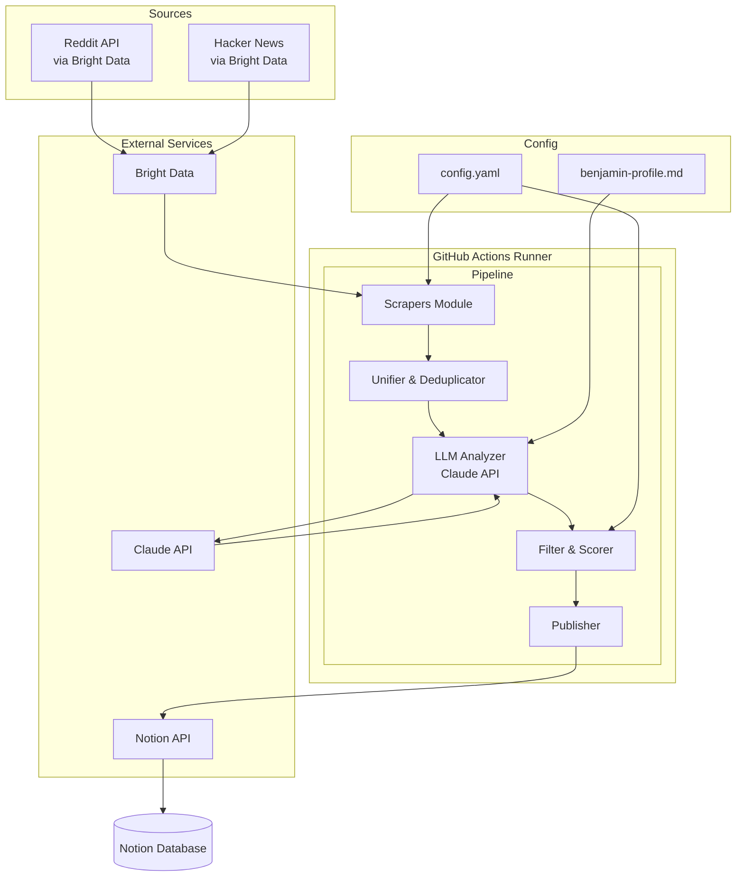
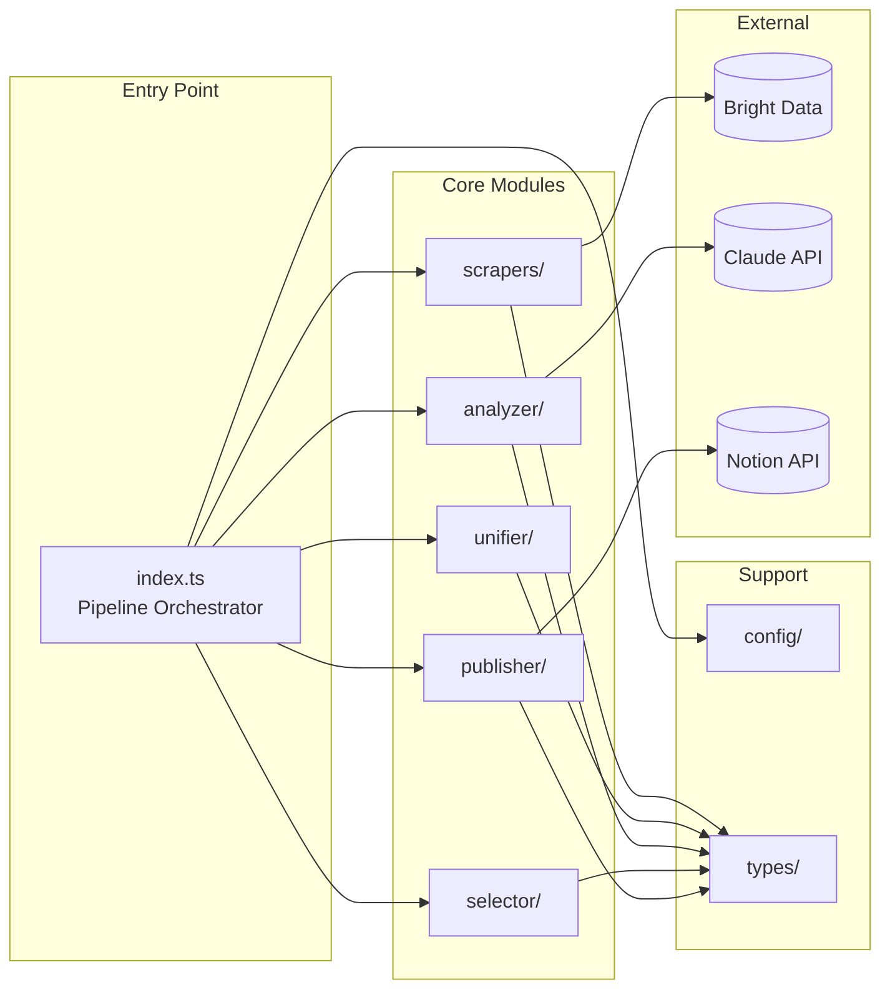
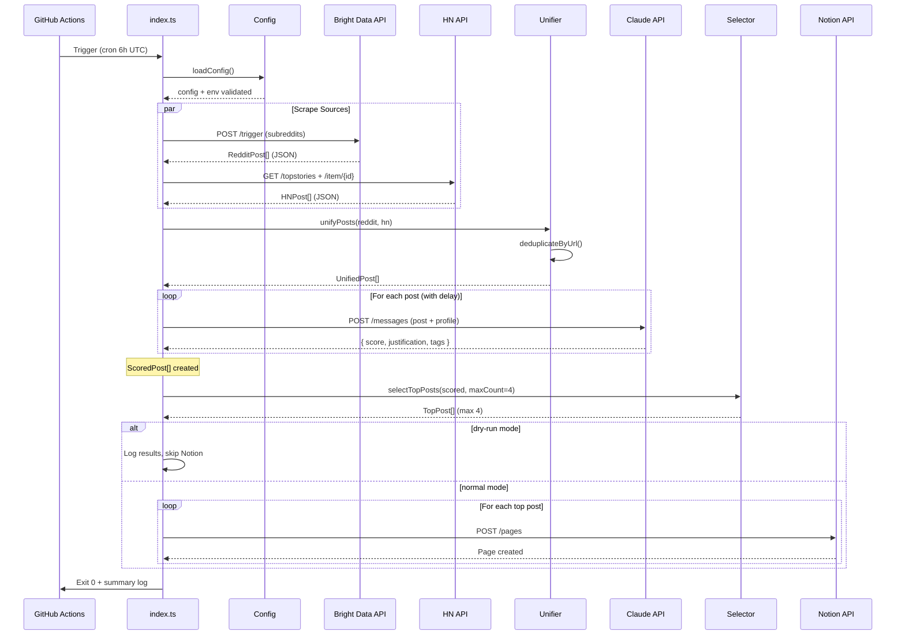
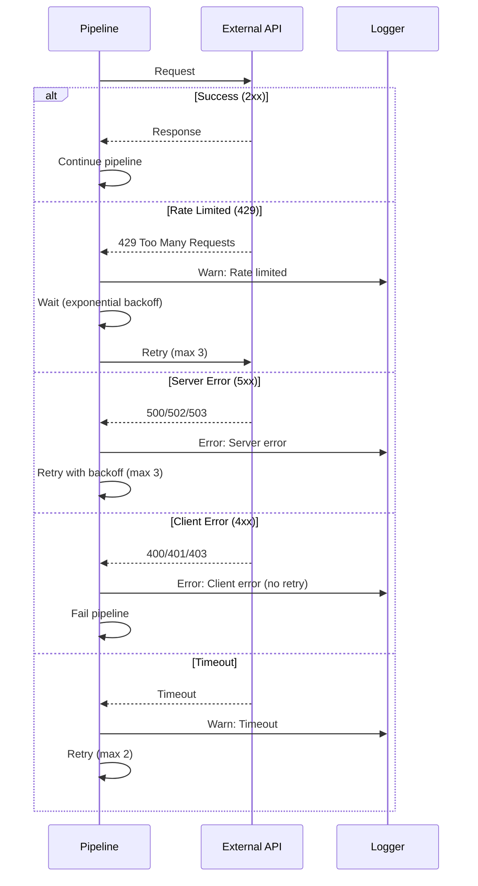

# Tech Watch Tool - Architecture Document

## Introduction

This document outlines the overall project architecture for Tech Watch Tool, including backend systems, shared services, and non-UI specific concerns. Its primary goal is to serve as the guiding architectural blueprint for AI-driven development, ensuring consistency and adherence to chosen patterns and technologies.

**Relationship to Frontend Architecture:**
This project has no frontend component — it's a data pipeline that outputs to Notion. No separate Frontend Architecture Document is needed.

### Starter Template or Existing Project

**N/A** — Projet greenfield sans starter template. Setup manuel léger avec TypeScript, ESLint/Prettier. Un starter serait surdimensionné pour ce pipeline simple.

### Change Log

| Date | Version | Description | Author |
|------|---------|-------------|--------|
| 2025-12-10 | 0.1 | Création initiale du document d'architecture | Winston (Architect) |

---

## High Level Architecture

### Technical Summary

Le **Tech Watch Tool** est un pipeline data serverless qui collecte, filtre et distribue du contenu tech pertinent. L'architecture suit un pattern **ETL (Extract-Transform-Load)** simple :

- **Extract:** Scrapers Bright Data pour Reddit + Hacker News
- **Transform:** Analyse LLM via Claude API avec scoring selon le "Profil Benjamin"
- **Load:** Publication vers Notion API

Le système s'exécute quotidiennement via GitHub Actions (cron), sans serveur persistant. Cette architecture "run-once" minimise les coûts et la complexité opérationnelle tout en répondant aux objectifs du PRD : livrer 3-4 sujets pertinents par jour sans intervention manuelle.

### High Level Overview

**1. Style architectural:** Pipeline ETL Serverless
- Pas de serveur persistant
- Exécution à la demande (cron quotidien)
- Stateless — chaque run est indépendant

**2. Repository Structure:** Monorepo
- Un seul repo pour tout le projet
- Simplicité de maintenance pour un outil personnel

**3. Service Architecture:** Script-based
- Un seul point d'entrée (`src/index.ts`)
- Modules internes pour chaque responsabilité
- Pas de microservices — overkill pour ce cas d'usage

**4. Data Flow:**
```
Sources (Reddit/HN) → Scrapers → Unified Posts → LLM Analysis → Top Selection → Notion
```

**5. Décisions architecturales clés:**
- **Bright Data obligatoire** (sponsor existant — NFR1)
- **Claude API pour le filtrage** (pas de ML custom)
- **GitHub Actions comme runtime** (gratuit, simple)
- **Notion comme output** (Benjamin l'utilise déjà)

### High Level Project Diagram



### Architectural and Design Patterns

| Pattern | Description | Rationale |
|---------|-------------|-----------|
| **Pipeline Pattern** | Traitement séquentiel en étapes distinctes (scrape → analyze → publish) | Clarté du flow, facilité de debug, chaque étape isolée et testable |
| **Repository Pattern** | Abstraction de l'accès aux sources de données (Reddit, HN) | Permet de changer de source ou d'ajouter Twitter V2 sans modifier le core |
| **Strategy Pattern** | Différents scrapers implémentent une interface commune | Extensibilité pour nouvelles sources |
| **Configuration-Driven** | Paramètres externalisés dans YAML | Itération rapide sans modifier le code (subreddits, seuils, etc.) |
| **Fail-Fast with Retry** | Erreurs propagées avec retry intelligent | Robustesse face aux APIs instables |

---

## Tech Stack

### Cloud Infrastructure

- **Provider:** GitHub (Actions pour le compute, Secrets pour les credentials)
- **Key Services:** GitHub Actions runners (Ubuntu latest)
- **Deployment Regions:** N/A (serverless, GitHub-managed)

*Note: Pas de cloud provider traditionnel (AWS/GCP/Azure) — le projet utilise uniquement GitHub Actions comme "compute" gratuit.*

### Technology Stack Table

| Category | Technology | Version | Purpose | Rationale |
|----------|------------|---------|---------|-----------|
| **Language** | TypeScript | 5.3 | Langage principal | Typage fort, excellent écosystème Node.js, maintenabilité |
| **Runtime** | Node.js | 20 LTS | Environnement d'exécution | Version LTS stable, support long terme, compatible GH Actions |
| **Scraping** | Bright Data SDK | latest | Scraping Reddit + HN | Sponsor existant (NFR1), gère proxies et anti-bot |
| **LLM** | @anthropic-ai/sdk | ^0.32 | Intégration Claude API | SDK officiel, TypeScript natif, gestion streaming |
| **Output** | @notionhq/client | ^2.2 | Publication Notion | SDK officiel Notion, bien maintenu |
| **Config** | yaml | ^2.3 | Parsing config.yaml | Standard, léger, pas de dépendances |
| **HTTP** | Built-in fetch | native | Requêtes HTTP si besoin | Node 20 inclut fetch natif, pas de dep externe |
| **Validation** | zod | ^3.22 | Validation des données | Type-safe, excellent avec TypeScript |
| **Linting** | ESLint | ^9.0 | Qualité du code | Flat config moderne, standard industrie |
| **Formatting** | Prettier | ^3.2 | Formatage code | Standard industrie, intégration ESLint |
| **Testing** | Vitest | ^2.0 | Tests unitaires/intégration | Rapide, compatible Jest API, TypeScript natif |
| **Build** | tsx | ^4.7 | Exécution TypeScript | Pas de build step, exécution directe TS |

---

## Data Models

### UnifiedPost

**Purpose:** Format standardisé pour tous les posts, quelle que soit la source (Reddit ou HN).

| Attribute | Type | Description |
|-----------|------|-------------|
| `id` | string | Identifiant unique (format: `{source}_{originalId}`) |
| `title` | string | Titre du post |
| `url` | string | URL vers le contenu (article externe ou discussion) |
| `sourceUrl` | string | URL vers la discussion source (Reddit thread / HN comments) |
| `source` | `'reddit' \| 'hn'` | Provenance du post |
| `subreddit` | string \| null | Subreddit d'origine (null pour HN) |
| `score` | number | Score/upvotes sur la plateforme source |
| `commentCount` | number | Nombre de commentaires |
| `author` | string | Auteur du post |
| `createdAt` | Date | Date de création du post |
| `scrapedAt` | Date | Date de scraping |

**Relationships:**
- Transformé depuis `RedditPost` ou `HNPost`
- Input pour `ScoredPost`

### ScoredPost

**Purpose:** Post enrichi avec l'analyse Claude et le scoring selon le "Profil Benjamin".

| Attribute | Type | Description |
|-----------|------|-------------|
| `post` | UnifiedPost | Le post original |
| `relevanceScore` | number (1-10) | Score de pertinence pour les brèves |
| `justification` | string | Explication courte de Claude (2-3 phrases) |
| `tags` | string[] | Tags de catégorisation (`drama`, `success-story`, `ia`, etc.) |
| `rejected` | boolean | True si score < seuil |
| `rejectionReason` | string \| null | Raison du rejet (anti-critère déclenché) |
| `analyzedAt` | Date | Timestamp de l'analyse |

**Relationships:**
- Étend `UnifiedPost`
- Input pour sélection des top posts
- Les top posts deviennent `NotionEntry`

### NotionEntry

**Purpose:** Structure de données pour créer une page dans la database Notion.

| Attribute | Type | Description |
|-----------|------|-------------|
| `title` | string | Titre du sujet (peut être reformulé par Claude) |
| `description` | string | Résumé/justification pour Benjamin |
| `sourceUrls` | string[] | Liens vers Reddit/HN/article original |
| `sources` | string[] | Liste des plateformes (`Reddit`, `HN`) |
| `relevanceScore` | number | Score 1-10 |
| `tags` | string[] | Multi-select Notion |
| `rating` | null | Champ vide pour feedback manuel (1-5 étoiles) |
| `date` | Date | Date de publication dans Notion |

**Relationships:**
- Créé depuis `ScoredPost`
- Correspond au schéma de la database Notion cible

### Config (config.yaml)

**Purpose:** Configuration externalisée du pipeline.

| Attribute | Type | Description |
|-----------|------|-------------|
| `sources.reddit.subreddits` | string[] | Liste des subreddits à scraper |
| `sources.reddit.limit` | number | Nombre de posts par subreddit |
| `sources.hn.limit` | number | Nombre de posts HN (front page) |
| `filtering.minScore` | number | Score minimum pour passer (défaut: 6) |
| `filtering.maxPosts` | number | Nombre max de posts à publier (défaut: 4) |
| `notion.databaseId` | string | ID de la database Notion cible |

---

## Components

### Scrapers Module (`src/scrapers/`)

**Responsibility:** Récupérer les posts bruts depuis Reddit et Hacker News via Bright Data.

**Key Interfaces:**
- `scrapeReddit(config: RedditConfig): Promise<RedditPost[]>`
- `scrapeHackerNews(config: HNConfig): Promise<HNPost[]>`
- `ScraperInterface` — interface commune pour tous les scrapers

**Dependencies:** Bright Data SDK, Config module

**Technology Stack:** Bright Data SDK, zod pour validation

---

### Unifier Module (`src/unifier/`)

**Responsibility:** Convertir les posts de différentes sources en format unifié et dédupliquer.

**Key Interfaces:**
- `unifyPosts(reddit: RedditPost[], hn: HNPost[]): UnifiedPost[]`
- `deduplicateByUrl(posts: UnifiedPost[]): UnifiedPost[]`

**Dependencies:** Types module

**Technology Stack:** Pure TypeScript

---

### Analyzer Module (`src/analyzer/`)

**Responsibility:** Analyser et scorer chaque post via Claude API selon le "Profil Benjamin".

**Key Interfaces:**
- `analyzePost(post: UnifiedPost, profile: string): Promise<ScoredPost>`
- `analyzeBatch(posts: UnifiedPost[], profile: string): Promise<ScoredPost[]>`

**Dependencies:** Anthropic SDK, Prompt file, Config module

**Technology Stack:** Claude API (claude-3-haiku ou claude-3-sonnet), zod

---

### Selector Module (`src/selector/`)

**Responsibility:** Sélectionner les N meilleurs posts pour publication.

**Key Interfaces:**
- `selectTopPosts(posts: ScoredPost[], maxCount: number): ScoredPost[]`

**Dependencies:** Config module

**Technology Stack:** Pure TypeScript

---

### Publisher Module (`src/publisher/`)

**Responsibility:** Créer les entrées dans la database Notion.

**Key Interfaces:**
- `publishToNotion(posts: ScoredPost[]): Promise<NotionEntry[]>`
- `createNotionPage(post: ScoredPost): Promise<NotionEntry>`

**Dependencies:** Notion SDK, Config module

**Technology Stack:** Notion API v2

---

### Config Module (`src/config/`)

**Responsibility:** Charger et valider la configuration YAML et les variables d'environnement.

**Key Interfaces:**
- `loadConfig(): Config`
- `validateEnv(): void`

**Dependencies:** yaml, zod

**Technology Stack:** yaml, zod, dotenv (dev only)

---

### Pipeline Orchestrator (`src/index.ts`)

**Responsibility:** Point d'entrée principal, orchestre l'exécution séquentielle de tous les modules.

**Key Interfaces:**
- `runPipeline(options?: { dryRun: boolean }): Promise<PipelineResult>`

**Dependencies:** Tous les modules

**Technology Stack:** TypeScript, console logging

---

### Component Diagram



---

## External APIs

### Bright Data Dataset API (Reddit uniquement)

- **Purpose:** Récupérer les top posts Reddit en JSON structuré
- **Documentation:** https://docs.brightdata.com/scraping-automation/web-data-apis/web-scraper/datasets/reddit
- **Base URL(s):** `https://api.brightdata.com/datasets/v3/`
- **Authentication:** API Key via `BRIGHT_DATA_API_KEY` env var
- **Rate Limits:** Selon le plan (flexible)

**Key Endpoints Used:**
- `POST /trigger` — Déclencher la collecte pour les subreddits configurés
- `GET /snapshot/{id}` — Récupérer les résultats JSON

**Response Format:**
```json
{
  "title": "Post title",
  "url": "https://...",
  "score": 1234,
  "num_comments": 89,
  "author": "username",
  "created_utc": 1702234567,
  "subreddit": "programming"
}
```

**Integration Notes:**
- Pas de parsing HTML — données structurées directement
- Configurer les subreddits cibles dans la requête
- Réponse asynchrone possible (trigger → poll snapshot)

---

### Hacker News API (Officielle)

- **Purpose:** Récupérer les top stories de la front page HN
- **Documentation:** https://github.com/HackerNews/API
- **Base URL(s):** `https://hacker-news.firebaseio.com/v0/`
- **Authentication:** Aucune (API publique)
- **Rate Limits:** Pas de limite documentée (usage raisonnable)

**Key Endpoints Used:**
- `GET /topstories.json` — IDs des 500 top stories
- `GET /item/{id}.json` — Détails d'un item (post)

**Response Format:**
```json
{
  "id": 12345,
  "title": "Show HN: Something cool",
  "url": "https://...",
  "score": 234,
  "descendants": 45,
  "by": "username",
  "time": 1702234567,
  "type": "story"
}
```

**Integration Notes:**
- Gratuit, fiable, maintenu par YC
- Nécessite 2 appels : liste des IDs → détails de chaque post
- Limiter à top 30 posts pour respecter le PRD
- Pas de dépendance Bright Data = moins de coûts

---

### Claude API (Anthropic)

- **Purpose:** Analyse et scoring des posts selon le "Profil Benjamin"
- **Documentation:** https://docs.anthropic.com/
- **Base URL(s):** `https://api.anthropic.com/v1`
- **Authentication:** API Key via `ANTHROPIC_API_KEY` env var
- **Rate Limits:** Tier 1: 60 RPM, 60K tokens/min

**Key Endpoints Used:**
- `POST /messages` — Analyse du post, réponse JSON structurée

**Integration Notes:**
- Utiliser `claude-3-haiku-20240307` pour minimiser les coûts
- Retry avec backoff exponentiel pour les 429

---

### Notion API

- **Purpose:** Création des entrées quotidiennes dans la database de Benjamin
- **Documentation:** https://developers.notion.com/
- **Base URL(s):** `https://api.notion.com/v1`
- **Authentication:** Internal Integration Token via `NOTION_API_KEY` env var
- **Rate Limits:** 3 requests/second (average)

**Key Endpoints Used:**
- `POST /pages` — Créer une nouvelle page dans la database

**Integration Notes:**
- L'intégration doit être ajoutée à la database Notion manuellement
- Le schéma de la database doit correspondre aux champs `NotionEntry`

---

## Core Workflows

### Main Pipeline Workflow



### Error Handling Flow



### Daily Execution Timeline

```
06:00 UTC - GitHub Actions cron trigger
06:00:01  - Load config, validate env
06:00:02  - Start scraping (parallel)
06:00:10  - Reddit data received (~50 posts)
06:00:15  - HN data received (~30 posts)
06:00:16  - Unify + deduplicate (~70 unique posts)
06:00:17  - Start Claude analysis
06:03:00  - Analysis complete (~70 posts × 2s each)
06:03:01  - Select top 4 posts
06:03:02  - Publish to Notion (4 pages)
06:03:10  - Pipeline complete, exit 0

Total: ~3-4 minutes (well under NFR2's 10 min limit)
```

---

## Source Tree

```
tech-watch-tool/
├── .github/
│   └── workflows/
│       └── daily-pipeline.yml    # GitHub Actions cron workflow
│
├── src/
│   ├── index.ts                  # Pipeline orchestrator (entry point)
│   │
│   ├── config/
│   │   ├── index.ts              # Config loader + env validation
│   │   └── schema.ts             # Zod schemas for config validation
│   │
│   ├── scrapers/
│   │   ├── index.ts              # Barrel export
│   │   ├── reddit.ts             # Bright Data Reddit fetcher
│   │   └── hackernews.ts         # HN API fetcher
│   │
│   ├── unifier/
│   │   ├── index.ts              # Unify + deduplicate logic
│   │   └── deduplicator.ts       # URL-based deduplication
│   │
│   ├── analyzer/
│   │   ├── index.ts              # Claude API integration
│   │   └── prompt-loader.ts      # Load benjamin-profile.md
│   │
│   ├── selector/
│   │   └── index.ts              # Top posts selection logic
│   │
│   ├── publisher/
│   │   └── index.ts              # Notion API integration
│   │
│   └── types/
│       ├── index.ts              # Barrel export
│       ├── posts.ts              # RedditPost, HNPost, UnifiedPost, ScoredPost
│       ├── config.ts             # Config types
│       └── notion.ts             # NotionEntry types
│
├── prompts/
│   └── benjamin-profile.md       # LLM prompt with scoring criteria
│
├── tests/
│   ├── unit/
│   │   ├── unifier.test.ts
│   │   ├── selector.test.ts
│   │   └── deduplicator.test.ts
│   └── integration/
│       ├── reddit.test.ts        # Mock Bright Data responses
│       ├── hackernews.test.ts    # Mock HN API responses
│       └── analyzer.test.ts      # Mock Claude responses
│
├── config.yaml                   # Runtime configuration
├── .env.example                  # Environment variables template
├── .gitignore
├── package.json
├── tsconfig.json
├── eslint.config.js              # ESLint flat config
├── prettier.config.js
├── vitest.config.ts
└── README.md
```

**Conventions:**
- Un fichier `index.ts` par module = barrel export
- Tests miroir la structure src
- Pas de `dist/` — tsx exécute directement TypeScript

---

## Infrastructure and Deployment

### Infrastructure as Code

- **Tool:** N/A (pas d'IaC traditionnel)
- **Approach:** GitHub Actions = infrastructure as YAML

Le projet n'utilise pas de cloud provider traditionnel. GitHub Actions EST l'infrastructure :
- Compute : GitHub-hosted runners (Ubuntu)
- Secrets : GitHub Secrets
- Scheduling : Cron intégré aux workflows
- Logs : GitHub Actions logs (rétention 90 jours)

### Deployment Strategy

- **Strategy:** "Deploy on merge" — le code EST le déploiement
- **CI/CD Platform:** GitHub Actions
- **Pipeline Configuration:** `.github/workflows/daily-pipeline.yml`

Pas de déploiement traditionnel — le pipeline s'exécute directement depuis le repo.

### GitHub Actions Workflow

```yaml
# .github/workflows/daily-pipeline.yml
name: Daily Tech Watch Pipeline

on:
  schedule:
    - cron: '0 6 * * *'  # 6h UTC = 7h Paris (hiver) / 8h (été)
  workflow_dispatch:      # Manual trigger

jobs:
  run-pipeline:
    runs-on: ubuntu-latest
    timeout-minutes: 10   # NFR2 compliance

    steps:
      - uses: actions/checkout@v4

      - uses: actions/setup-node@v4
        with:
          node-version: '20'
          cache: 'npm'

      - run: npm ci

      - run: npm run pipeline
        env:
          BRIGHT_DATA_API_KEY: ${{ secrets.BRIGHT_DATA_API_KEY }}
          ANTHROPIC_API_KEY: ${{ secrets.ANTHROPIC_API_KEY }}
          NOTION_API_KEY: ${{ secrets.NOTION_API_KEY }}
          NOTION_DATABASE_ID: ${{ secrets.NOTION_DATABASE_ID }}
```

### Environments

| Environment | Purpose | Details |
|-------------|---------|---------|
| **Local** | Développement | `npm run dev` avec `.env` local, mode `--dry-run` |
| **Production** | Exécution quotidienne | GitHub Actions avec secrets, publie sur Notion |

### Environment Promotion Flow

```
Local Development → git push → main branch → GitHub Actions (cron) → Notion Output
```

### Rollback Strategy

- **Primary Method:** Git revert + re-run workflow
- **Trigger Conditions:** Pipeline failure, mauvaise qualité des résultats
- **Recovery Time Objective:** < 5 minutes

Procédure : `git revert` → push → trigger manuel workflow

---

## Error Handling Strategy

### General Approach

- **Error Model:** Fail-fast avec retry intelligent
- **Exception Hierarchy:** Erreurs typées par domaine (ScraperError, AnalyzerError, PublisherError)
- **Error Propagation:** Les erreurs remontent au pipeline orchestrator qui décide de retry ou fail

```typescript
class PipelineError extends Error {
  constructor(message: string, public readonly cause?: Error) {
    super(message);
  }
}

class ScraperError extends PipelineError {}
class AnalyzerError extends PipelineError {}
class PublisherError extends PipelineError {}
class ConfigError extends PipelineError {}
```

### Logging Standards

- **Library:** Console (natif Node.js)
- **Format:** JSON structuré
- **Levels:** `info`, `warn`, `error`

```typescript
{
  "level": "info",
  "timestamp": "2025-12-10T06:00:15.123Z",
  "stage": "scraper",
  "message": "Reddit scraping complete",
  "data": { "postCount": 47, "duration": 8234 }
}
```

### Error Handling Patterns

#### External API Errors

| API | Retry Policy | Timeout |
|-----|--------------|---------|
| Bright Data | 3 retries, exponential backoff (1s, 2s, 4s) | 30s |
| HN API | 3 retries, 500ms backoff | 10s |
| Claude API | 3 retries, exponential backoff | 60s |
| Notion API | 3 retries, 1s backoff | 15s |

#### Business Logic Errors

- **Aucun post trouvé:** Warning, pipeline continue (0 entrées Notion)
- **Tous les posts rejetés:** Warning, pipeline continue
- **Moins de 4 posts passent le seuil:** Info, publie ce qui est disponible

#### Data Consistency

- **Idempotency:** Pas de déduplication Notion (acceptable pour 1 run/jour)
- **Partial Failure:** Si Notion échoue après 2/4 posts, les premiers restent. Pipeline exit 1.

---

## Coding Standards

### Core Standards

- **Language & Runtime:** TypeScript 5.3, Node.js 20 LTS
- **Style & Linting:** ESLint 9 (flat config) + Prettier
- **Test Organization:** `tests/unit/*.test.ts`, `tests/integration/*.test.ts`

### Naming Conventions

| Element | Convention | Example |
|---------|------------|---------|
| Files | kebab-case | `hacker-news.ts`, `prompt-loader.ts` |
| Functions | camelCase | `scrapeReddit()`, `analyzePost()` |
| Types/Interfaces | PascalCase | `UnifiedPost`, `ScoredPost` |
| Constants | SCREAMING_SNAKE_CASE | `MAX_RETRIES`, `DEFAULT_TIMEOUT` |
| Env vars | SCREAMING_SNAKE_CASE | `ANTHROPIC_API_KEY` |

### Critical Rules

1. **Toujours valider les données externes avec zod** — Toute réponse API doit être validée

2. **Utiliser le logger structuré, pas console.log direct**
   ```typescript
   // ✅ Requis
   logger.info('scraper', 'Scraping complete', { postCount: 47 });
   ```

3. **Toujours typer explicitement les retours de fonction async**
   ```typescript
   // ✅ Requis
   async function scrape(): Promise<RedditPost[]> { ... }
   ```

4. **Gérer les erreurs avec les classes d'erreur définies**
   ```typescript
   // ✅ Requis
   throw new ScraperError('Bright Data API failed', { cause: err });
   ```

5. **Pas de `any`** — utiliser `unknown` si le type est vraiment inconnu

6. **Toute constante magique doit être dans config.yaml ou en constante nommée**

7. **Les secrets viennent UNIQUEMENT de process.env, jamais hardcodés**

---

## Test Strategy and Standards

### Testing Philosophy

- **Approach:** Test-after (pragmatique pour un projet simple)
- **Coverage Goals:** 80% pour la logique métier (unifier, selector, deduplicator)
- **Test Pyramid:** Unit 70% / Integration 30% / E2E 0%

### Unit Tests

- **Framework:** Vitest 2.0
- **File Convention:** `*.test.ts`
- **Location:** `tests/unit/`
- **Mocking Library:** Vitest built-in (`vi.mock`, `vi.fn`)
- **Coverage Requirement:** 80% branches pour les modules critiques

**Modules prioritaires:** `unifier/`, `selector/`, `deduplicator`, `config/schema`

**Pattern requis:** AAA (Arrange, Act, Assert)

```typescript
describe('selectTopPosts', () => {
  it('should return max 4 posts sorted by score', () => {
    // Arrange
    const posts: ScoredPost[] = [...];
    // Act
    const result = selectTopPosts(posts, 4);
    // Assert
    expect(result[0].relevanceScore).toBe(9);
  });
});
```

### Integration Tests

- **Scope:** Modules avec APIs mockées
- **Location:** `tests/integration/`

| Dependency | Test Approach |
|------------|---------------|
| Bright Data API | Mock fetch avec fixtures JSON |
| HN API | Mock fetch avec fixtures JSON |
| Claude API | Mock @anthropic-ai/sdk |
| Notion API | Mock @notionhq/client |

### Test Data Management

- **Strategy:** Fixtures JSON statiques
- **Location:** `tests/fixtures/`

### Continuous Testing

```yaml
# .github/workflows/ci.yml
- run: npm run lint
- run: npm run test
- run: npm audit --audit-level=high
```

---

## Security

### Input Validation

- **Validation Library:** zod
- **Validation Location:** À l'entrée de chaque module (boundary)
- **Required Rules:** Toutes les réponses API externes validées avec zod schemas

```typescript
const RedditPostSchema = z.object({
  title: z.string().min(1),
  url: z.string().url(),
  score: z.number().int().min(0),
  num_comments: z.number().int().min(0),
  author: z.string(),
  created_utc: z.number(),
  subreddit: z.string(),
});
```

### Authentication & Authorization

- **Auth Method:** API Keys (pas d'OAuth, pas de JWT)
- **Session Management:** N/A (script stateless)
- Chaque SDK reçoit sa clé via constructeur, jamais dans les URLs ou logs

### Secrets Management

- **Development:** Fichier `.env` local (gitignored)
- **Production:** GitHub Secrets

| Secret | Source | Usage |
|--------|--------|-------|
| `BRIGHT_DATA_API_KEY` | Bright Data dashboard | Reddit scraping |
| `ANTHROPIC_API_KEY` | Anthropic console | Claude API |
| `NOTION_API_KEY` | Notion integrations | Notion API |
| `NOTION_DATABASE_ID` | Notion URL | Target database |

**Validation au démarrage :** Fail fast si un secret est manquant.

### Data Protection

- **Encryption in Transit:** HTTPS pour toutes les APIs
- **PII Handling:** Aucune donnée personnelle collectée (posts publics uniquement)
- **Logging Restrictions:**
  - JAMAIS logger les API keys
  - JAMAIS logger les réponses complètes Claude
  - OK de logger titres et scores des posts

### Dependency Security

- **Scanning Tool:** `npm audit` (CI)
- **Update Policy:** Mensuel ou sur alerte critique

---

## Checklist Results Report

### Executive Summary

| Metric | Value |
|--------|-------|
| **Architecture Readiness** | HIGH |
| **Project Type** | Backend-only (Pipeline/Script) |
| **Sections Evaluated** | 8/10 (Frontend sections skipped) |
| **Overall Pass Rate** | ~92% |

### Section Analysis

| Section | Pass Rate | Status |
|---------|-----------|--------|
| Requirements Alignment | 100% | PASS |
| Architecture Fundamentals | 100% | PASS |
| Technical Stack & Decisions | 95% | PASS |
| Frontend Design | N/A | SKIPPED |
| Resilience & Operational Readiness | 90% | PASS |
| Security & Compliance | 95% | PASS |
| Implementation Guidance | 100% | PASS |
| Dependency & Integration | 90% | PASS |
| AI Agent Suitability | 100% | PASS |

### Risk Assessment

| Risk | Severity | Mitigation |
|------|----------|------------|
| Bright Data change format | Medium | Validation zod échouera proprement |
| Claude API rate limited | Low | Retry avec backoff prévu |
| Coûts Claude > $10/mois | Low | Utiliser Haiku, monitorer usage |

### Verdict

**READY FOR DEVELOPMENT** — L'architecture est complète et prête pour implémentation.

---

## Next Steps

### Pour le développement

1. **Project Setup (Epic 1, Story 1.1)**
   - Initialiser le repo avec la structure définie
   - Configurer TypeScript, ESLint, Prettier, Vitest
   - Créer le fichier `config.yaml` avec les paramètres par défaut

2. **Implémenter les stories dans l'ordre des Epics du PRD**
   - Epic 1: Foundation & Scraping
   - Epic 2: LLM Filtering & Scoring
   - Epic 3: Notion Output & Pipeline

3. **Configuration Notion**
   - Créer la database Notion avec le schéma `NotionEntry`
   - Créer une intégration Notion et récupérer l'API key
   - Partager la database avec l'intégration

### Dev Agent Prompt

> L'architecture pour le Tech Watch Tool est prête dans `docs/architecture.md`.
>
> C'est un pipeline TypeScript qui :
> - Scrape Reddit via Bright Data Dataset API (JSON direct)
> - Scrape Hacker News via l'API officielle
> - Filtre avec Claude API selon le "Profil Benjamin"
> - Publie 3-4 sujets/jour dans Notion
> - S'exécute via GitHub Actions (cron quotidien)
>
> Commence par l'Epic 1, Story 1.1 (Project Setup) du PRD (`docs/prd.md`).
> Respecte les coding standards et la structure définie dans l'architecture.

