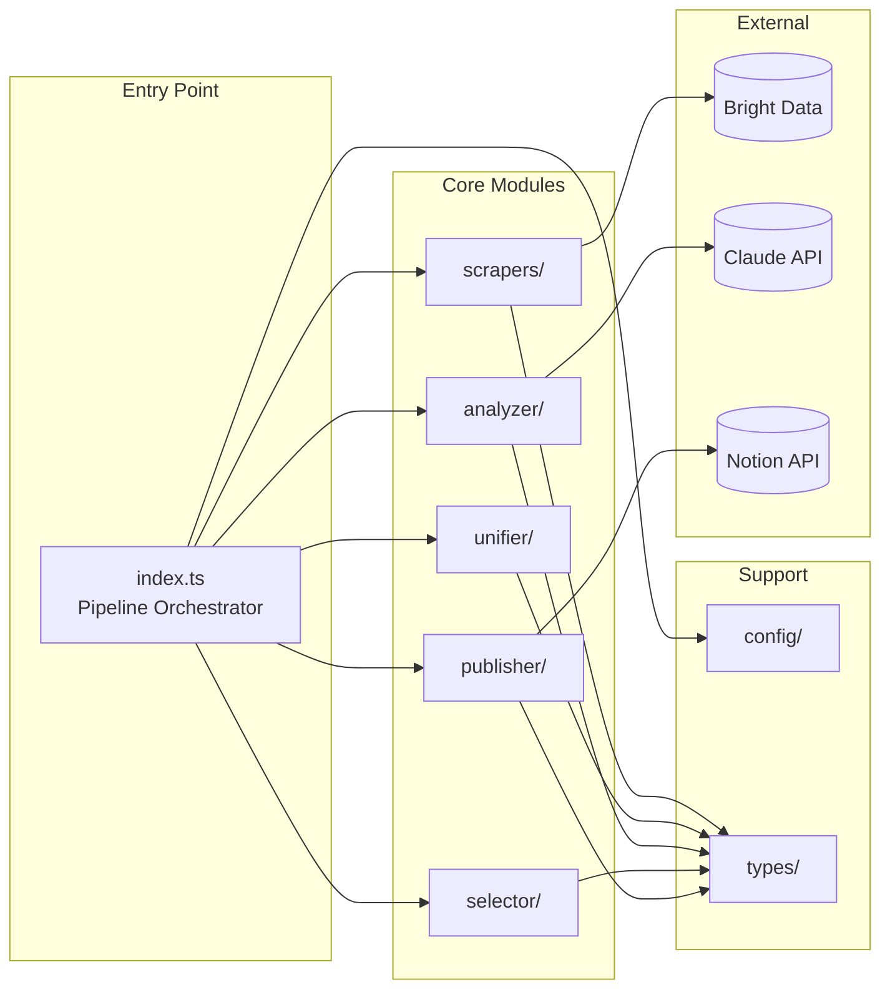

# Components

## Scrapers Module (`src/scrapers/`)

**Responsibility:** Récupérer les posts bruts depuis Reddit et Hacker News via Bright Data.

**Key Interfaces:**
- `scrapeReddit(config: RedditConfig): Promise<RedditPost[]>`
- `scrapeHackerNews(config: HNConfig): Promise<HNPost[]>`
- `ScraperInterface` — interface commune pour tous les scrapers

**Dependencies:** Bright Data SDK, Config module

**Technology Stack:** Bright Data SDK, zod pour validation

---

## Unifier Module (`src/unifier/`)

**Responsibility:** Convertir les posts de différentes sources en format unifié et dédupliquer.

**Key Interfaces:**
- `unifyPosts(reddit: RedditPost[], hn: HNPost[]): UnifiedPost[]`
- `deduplicateByUrl(posts: UnifiedPost[]): UnifiedPost[]`

**Dependencies:** Types module

**Technology Stack:** Pure TypeScript

---

## Analyzer Module (`src/analyzer/`)

**Responsibility:** Analyser et scorer chaque post via Claude API selon le "Profil Benjamin".

**Key Interfaces:**
- `analyzePost(post: UnifiedPost, profile: string): Promise<ScoredPost>`
- `analyzeBatch(posts: UnifiedPost[], profile: string): Promise<ScoredPost[]>`

**Dependencies:** Anthropic SDK, Prompt file, Config module

**Technology Stack:** Claude API (claude-3-haiku ou claude-3-sonnet), zod

---

## Selector Module (`src/selector/`)

**Responsibility:** Sélectionner les N meilleurs posts pour publication.

**Key Interfaces:**
- `selectTopPosts(posts: ScoredPost[], maxCount: number): ScoredPost[]`

**Dependencies:** Config module

**Technology Stack:** Pure TypeScript

---

## Publisher Module (`src/publisher/`)

**Responsibility:** Créer les entrées dans la database Notion.

**Key Interfaces:**
- `publishToNotion(posts: ScoredPost[]): Promise<NotionEntry[]>`
- `createNotionPage(post: ScoredPost): Promise<NotionEntry>`

**Dependencies:** Notion SDK, Config module

**Technology Stack:** Notion API v2

---

## Config Module (`src/config/`)

**Responsibility:** Charger et valider la configuration YAML et les variables d'environnement.

**Key Interfaces:**
- `loadConfig(): Config`
- `validateEnv(): void`

**Dependencies:** yaml, zod

**Technology Stack:** yaml, zod, dotenv (dev only)

---

## Pipeline Orchestrator (`src/index.ts`)

**Responsibility:** Point d'entrée principal, orchestre l'exécution séquentielle de tous les modules.

**Key Interfaces:**
- `runPipeline(options?: { dryRun: boolean }): Promise<PipelineResult>`

**Dependencies:** Tous les modules

**Technology Stack:** TypeScript, console logging

---

## Component Diagram

---
