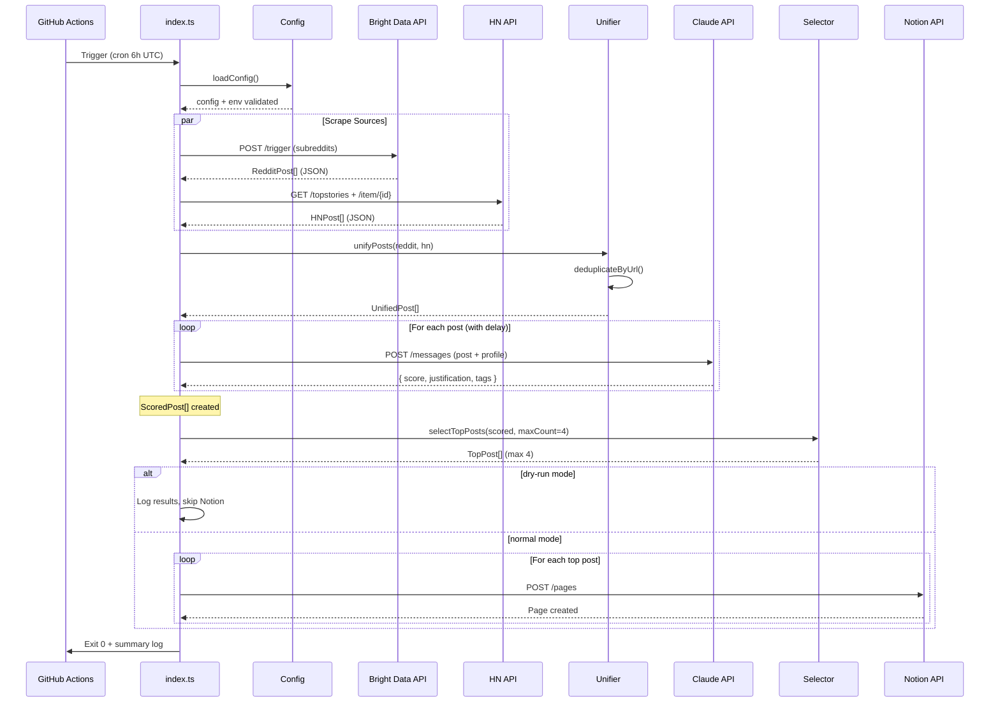
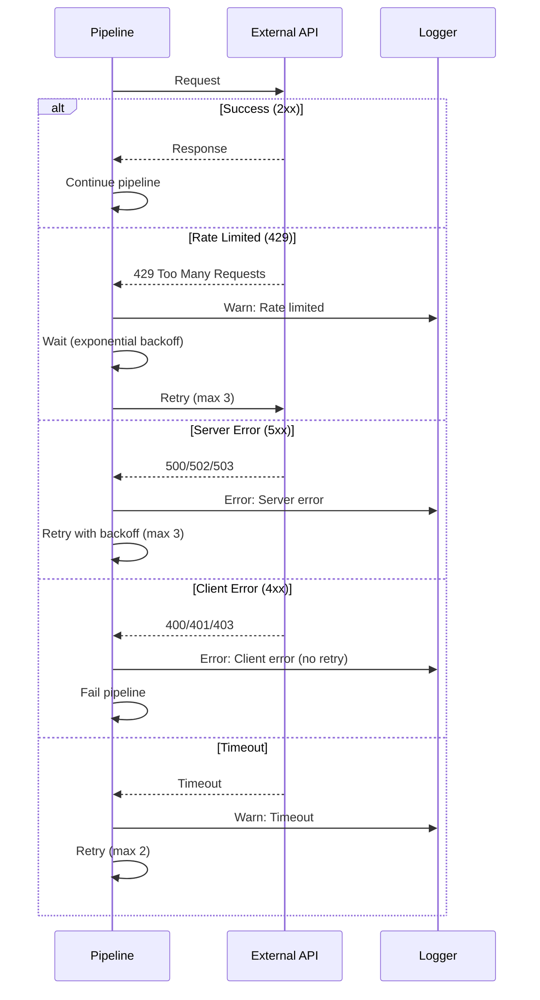

# Core Workflows

## Main Pipeline Workflow



## Error Handling Flow



## Daily Execution Timeline

```
06:00 UTC - GitHub Actions cron trigger
06:00:01  - Load config, validate env
06:00:02  - Start scraping (parallel)
06:00:10  - Reddit data received (~50 posts)
06:00:15  - HN data received (~30 posts)
06:00:16  - Unify + deduplicate (~70 unique posts)
06:00:17  - Start Claude analysis
06:03:00  - Analysis complete (~70 posts × 2s each)
06:03:01  - Select top 4 posts
06:03:02  - Publish to Notion (4 pages)
06:03:10  - Pipeline complete, exit 0

Total: ~3-4 minutes (well under NFR2's 10 min limit)
```

---
