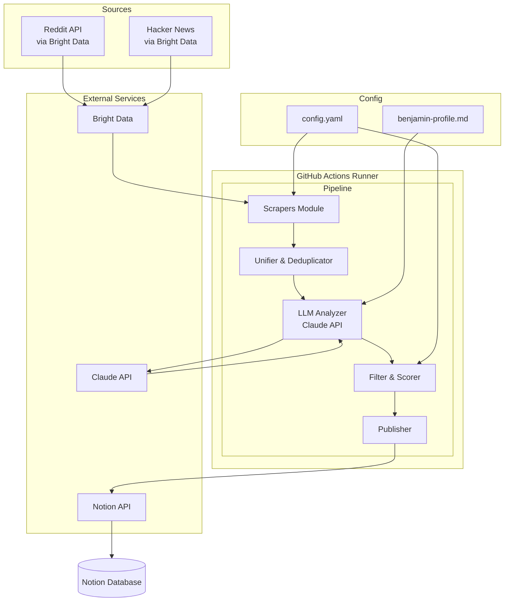

# High Level Architecture

## Technical Summary

Le **Tech Watch Tool** est un pipeline data serverless qui collecte, filtre et distribue du contenu tech pertinent. L'architecture suit un pattern **ETL (Extract-Transform-Load)** simple :

- **Extract:** Scrapers Bright Data pour Reddit + Hacker News
- **Transform:** Analyse LLM via Claude API avec scoring selon le "Profil Benjamin"
- **Load:** Publication vers Notion API

Le système s'exécute quotidiennement via GitHub Actions (cron), sans serveur persistant. Cette architecture "run-once" minimise les coûts et la complexité opérationnelle tout en répondant aux objectifs du PRD : livrer 3-4 sujets pertinents par jour sans intervention manuelle.

## High Level Overview

**1. Style architectural:** Pipeline ETL Serverless
- Pas de serveur persistant
- Exécution à la demande (cron quotidien)
- Stateless — chaque run est indépendant

**2. Repository Structure:** Monorepo
- Un seul repo pour tout le projet
- Simplicité de maintenance pour un outil personnel

**3. Service Architecture:** Script-based
- Un seul point d'entrée (`src/index.ts`)
- Modules internes pour chaque responsabilité
- Pas de microservices — overkill pour ce cas d'usage

**4. Data Flow:**
```
Sources (Reddit/HN) → Scrapers → Unified Posts → LLM Analysis → Top Selection → Notion
```

**5. Décisions architecturales clés:**
- **Bright Data obligatoire** (sponsor existant — NFR1)
- **Claude API pour le filtrage** (pas de ML custom)
- **GitHub Actions comme runtime** (gratuit, simple)
- **Notion comme output** (Benjamin l'utilise déjà)

## High Level Project Diagram



## Architectural and Design Patterns

| Pattern | Description | Rationale |
|---------|-------------|-----------|
| **Pipeline Pattern** | Traitement séquentiel en étapes distinctes (scrape → analyze → publish) | Clarté du flow, facilité de debug, chaque étape isolée et testable |
| **Repository Pattern** | Abstraction de l'accès aux sources de données (Reddit, HN) | Permet de changer de source ou d'ajouter Twitter V2 sans modifier le core |
| **Strategy Pattern** | Différents scrapers implémentent une interface commune | Extensibilité pour nouvelles sources |
| **Configuration-Driven** | Paramètres externalisés dans YAML | Itération rapide sans modifier le code (subreddits, seuils, etc.) |
| **Fail-Fast with Retry** | Erreurs propagées avec retry intelligent | Robustesse face aux APIs instables |

---
